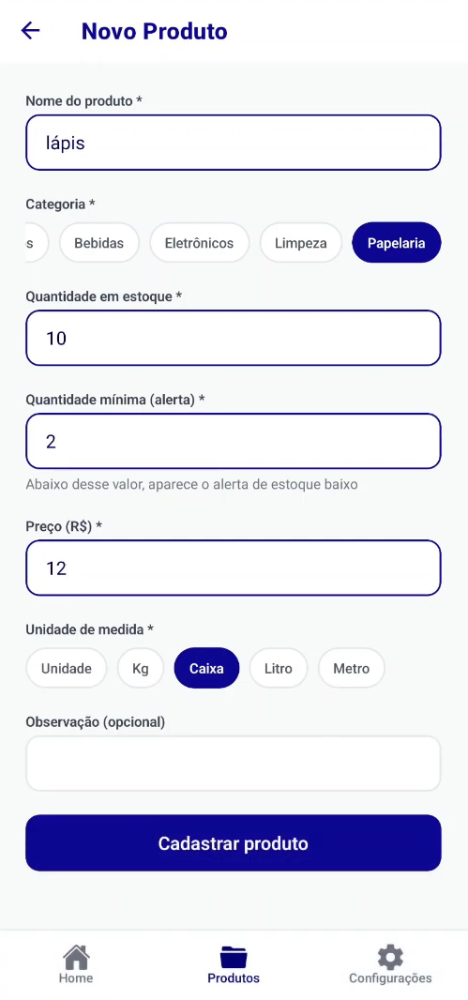
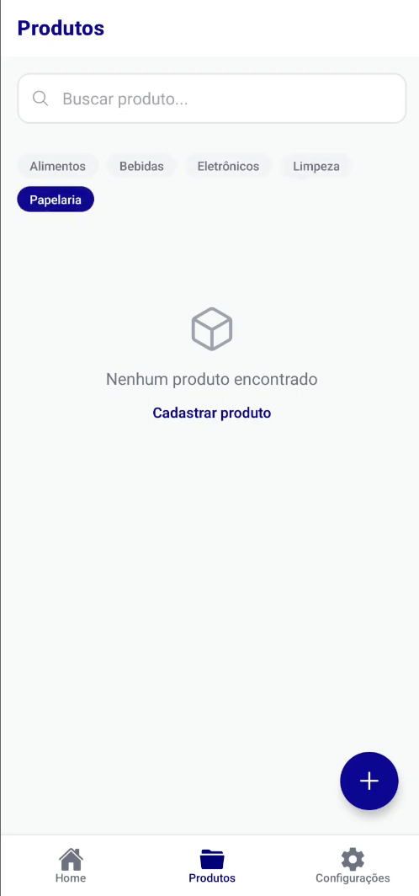
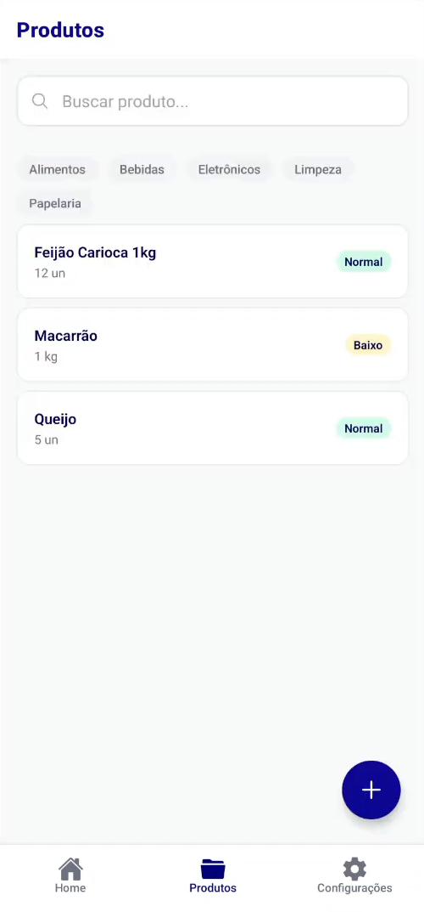
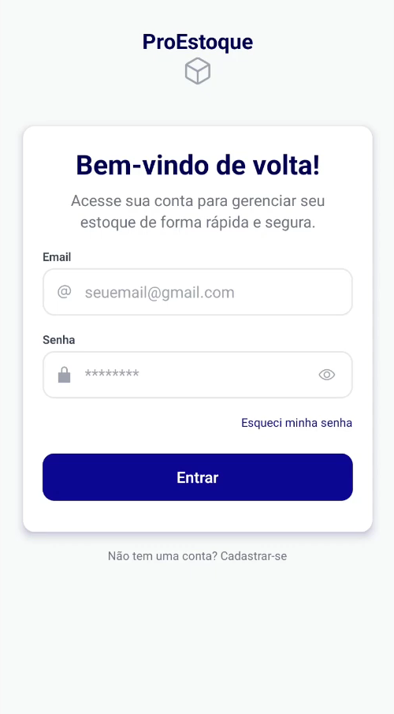

# 📦 ProEstoque 📱


<p align="left">
  
  
  
  
  
  
  
</p>

O **ProEstoque** é um aplicativo mobile completo para gerenciamento inteligente de estoque e mercadorias. Desenvolvido com uma arquitetura robusta e escalável, o ecossistema conta com um aplicativo nativo e uma API REST dedicada, garantindo alta performance e separação clara de responsabilidades.

---

## 🚀 Funcionalidades Principais

*   **Autenticação Segura:** Fluxo completo de login, registro e logout utilizando tokens JWT com persistência local estável.
*   **Controle de Acesso:** Guarda de rotas nativa que impede usuários não autenticados de acessarem o painel interno.
*   **Gerenciamento de Produtos (CRUD):** Criação, listagem, atualização e exclusão de itens com sincronização em tempo real e atualização de estado otimizada.
*   **Filtros por Categorias:** Abstração de busca e filtragem dinâmica de produtos de forma reativa.
*   **Tratamento de Erros Resiliente:** Telas customizadas para estados de carregamento (*Loading*) e falhas de conexão (*Error states*).

---

## 🛠️ Stack Tecnológica

### **Frontend (Mobile)**
*   **React Native / Expo** (TypeScript)
*   **Context API & Reducers** (Gerenciamento de Estado Global)
*   **Axios** (Com interceptors para injeção automática de JWT e tratamento de erro 401)
*   **AsyncStorage** (Persistência local do token de sessão)

### **Backend (API)**
*   **Node.js** com **Express** (TypeScript)
*   **Prisma ORM**
*   **SQLite** (Ambiente de Desenvolvimento Local)
*   **PostgreSQL** (Ambiente de Produção/Deploy no Railway)

---

## ⚙️ Como Executar o Projeto
1. Clonando o Repositório

```
git clone https://github.com/Jotshh/proestoque.git
cd proestoque

```

2. Configurando o Backend (https://github.com/Jotshh/proestoque-api)

2.1 Vá até o endereço https://github.com/Jotshh/proestoque-api e clone o repositório:

```
git clone https://github.com/Jotshh/proestoque-api.git
cd proestoque-api

```
Entre na pasta da API e instale as dependências:

```
cd proestoque-api
npm install

```

2.2 Crie um arquivo .env com a sua string de conexão:

```

DATABASE_URL="file:./dev.db" # Para SQLite local
PORT=3333

```

2.3 Rode as migrações do Prisma, e popule o banco de dados e inicie o servidor:

```

npx prisma migrate dev
npm run db:seed
npm run dev

```

3. Configurando o Frontend Mobile (proestoque)

3.1 Entre na pasta do proestoque e instale as dependências:

```

cd proestoque
npm install

```
3.2 Configure a variável de ambiente apontando para o IP da sua máquina ou da sua API:

```

EXPO_PUBLIC_API_URL=http://SEU_IP_AQUI:3333/api

```

3.3 Inicie o Expo Client:

```

npx expo start 

```

---

## 📄 Licença

Este projeto está licenciado sob a MIT License.

---

## 📄 Imagens do Aplicativo









## ▶️ Apresentação do Aplicativo em Video

https://www.youtube.com/watch?v=G8SbWYga-DI

---

## 💬 Suporte

Email: josiephelipel265@gmail.com


